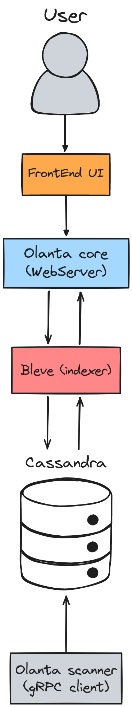
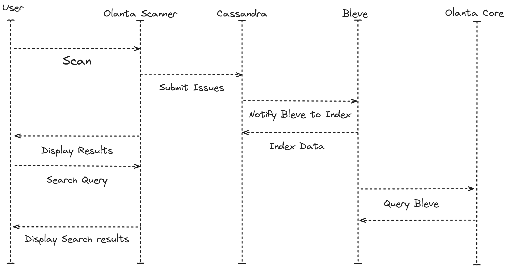

1. **Scanner Collects and Sends Data:**
   The Olanta Scanner collects data from the analyses and sends it to the Olanta Core via gRPC.

2. **Persistence in Cassandra:**
   Cassandra receives and stores the data from the analyses.

3. **Notification for Indexing in Bleve:**
   After the data is stored, Cassandra notifies Bleve to index the new data. This can be done through triggers or hooks that fire after data is inserted.

4. **Indexing in Bleve:**
   Bleve receives the data from Cassandra and indexes it to allow for quick searches.

5. **Data Queries and Manipulation:**
   When a query or search is made (for example, through a web interface), the Olanta Core first checks Bleve for quick results. If more details or complex transactions are needed, it can query Cassandra directly.